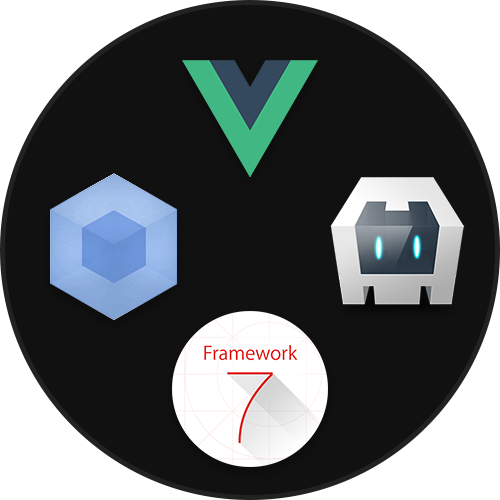

## IMPORTANT!
## This template is being maintained by, Armando Herra.
## The current release version of this template is v1.4.0
## Updates and new releases of the template can be found on it's main repository.
## Repository is here --> [GitHub](https://github.com/ArmandoHerra/VCWF-Template)

---

# Vue + Cordova + Webpack + Framework7 - Template
You can start creating awesome apps with this template right away!

This template uses:

* [Vue](https://vuejs.org/)
* [Cordova](https://cordova.apache.org/)
* [Webpack](https://webpack.github.io/)
* [Framework7](https://framework7.io)

## Minimum Requirements
* **Cordova:** _6.0.0_
* **Node.js:** _6.5.0_ (Supports ES6)

# Installation
## IMPORTANT: Phonegap build tools not supported currently. I suggest to use cordova with this template.

This template need cordova or phonegap, for more information [cordova installation](https://cordova.apache.org/docs/en/latest/guide/cli/) or [phonegap installation](http://docs.phonegap.com/getting-started/1-install-phonegap/desktop/).

---

## Basic Install Instructions:
1. Clone this repository.
2. Using the terminal navigate into the template_src directory.
3. Run `npm install` inside the template_src directory.
4. Run `npm run build` after the previous command.
5. Run `cordova platform add android browser ios`.
6. You are ready to run the ios apps from Xcode, Android apps using `npm run dev:android` while having an Android device connected and developing directly in the browser using `npm run dev:browser`.
7. **Another script that exists to get the repository ready and running a browser version of the Kitchen Sink app is using `npm run init`, just wait for all the dependencies to install, the code to be built, the cordova platforms to be added to the project and the browser to respond to the script.**

---

## Live Reload Usage

You can use every cordova | phonegap commands.
You just have one more command option: `-- --lr`. It starts live reload.

Example of live reload feature:
```
cordova run android -- --lr
cordova run browser -- --live-reload
phonegap run ios -- --lr
```

---

## Extra Features

Hooks! Hooks are smart. They can fix some problems for you. Fix list:
* `npm install` Automatically checks node js dependencies.
* `package.json` Renames `name` variable if it has a space characters and auto saves. (It needed for npm install)
* `www` Automatically manages `www` folder. You don't need to think about www folder. Your target is always `src` folder.
* `static` Static assets automatically sync on live reload!
* `CordovaHtmlOutputPlugin` Automatically adds `cordova.js` to html. You don't need to add to your file manually. It's helpful for webpack.
* `manifest.json` Some cordova plugins needs manifest.json in root folder. If you add manifest.json file to your `src` folder, our smart hooks automagically copy it to `www` folder!

## WARNING (For Linux and Mac OS users):

For live-reload I can't find easy way to do fixed version of this. But you can develop your app with this way:

1. `cordova platform add ios browser` (browser needs for development in live-reload mode.)
2. `cordova run ios -- --lr` (wait till app opens in your ios emulator or phone. it will close console output after publish, so live-reload will not work. don't close the app and go to next step.)
3. `cordova run browser -- --lr` (you can use live-reload in your phone-emulator and browser at same time. you can edit your files in live-reload mode now.)

###### Live Reload Related
* `config.xml` Live reload needs `<allow-navigation href="*"/>` in development mode. So our smart hooks manages this too. You don't need to think about it.
* `live-reload` Manages live-reload dependencies automatically. Just write your code, and don't think about dependencies.
* `device_router.html` Smart router in live-reload mode. It searches for best available ip for connect server. if it can't find, you can write ip:port manually.
* `CordovaDeviceRouter.js` In live-reload mode, you can connect to server from multiple devices. This file inject right `cordova.js` file to page. So you can connect to webpack-dev-server from multiple devices at same time.

You can check:
* [hookers.js](template_src/hooks/hookers.js),
* [beforedep.js](template_src/hooks/beforedep.js),
* [CordovaDeviceRouter.js](template_src/webpack/dev_helpers/CordovaDeviceRouter.js),
* [device_router.html](template_src/webpack/dev_helpers/device_router.html)

for more information.
